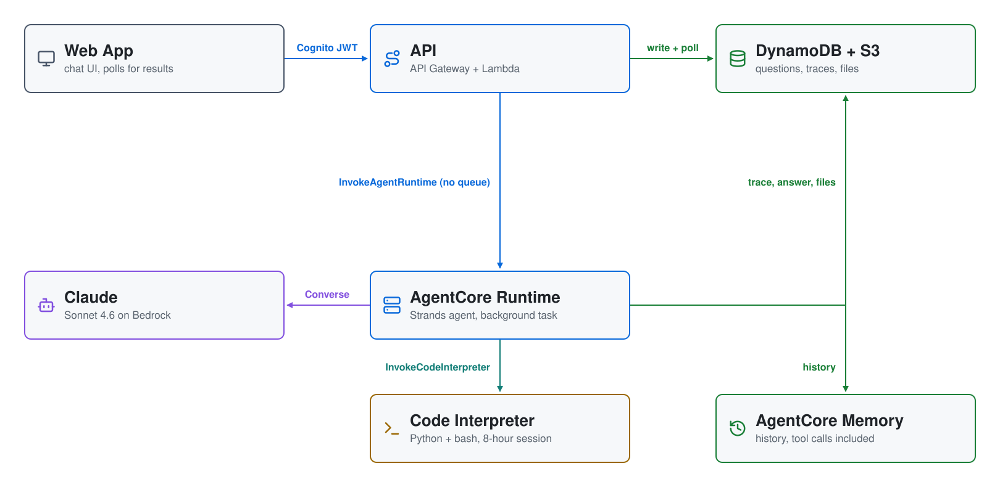

# AgentCore Sandbox (`aws-agentcore-sandbox`)

A chat app whose agent writes and runs code in an **Amazon Bedrock AgentCore
Code Interpreter** sandbox, hosted on **AgentCore Runtime**, with conversation
history in **AgentCore Memory**.

Ask *"Build me a fractal tree and get me the results"*. The agent writes
Python, runs it in its sandbox, **looks at the image it rendered**, fixes
anything wrong, and puts the picture in the chat. Expand the trace under the
answer to see each step.

This is the managed-services twin of
[aws-microvm-agent-sandbox](https://github.com/mamonaco1973/aws-microvm-agent-sandbox).
Both share the same web app, model, tools, prompts and demo script. The
difference is how the agent is built: that project builds its own sandbox,
hosting and memory on Lambda MicroVMs; this one uses AgentCore's managed
pieces. See [How it compares](#how-it-compares).

---

## What it showcases

1. **AgentCore Code Interpreter as an agent sandbox.** Each conversation
   gets its own session (2 vCPU, 8 GB), started the first time the agent
   runs code. Python state persists between calls for the session's life
   (8 hours at most).
2. **AgentCore Runtime hosting a long-running agent.** The API hands each
   message to the agent and returns immediately. The agent keeps working in
   the background (up to 8 hours per message), so there's no queue, no worker
   Lambda, and no 15-minute limit.
3. **AgentCore Memory for conversation history.** Strands'
   `AgentCoreMemorySessionManager` stores every message, tool calls
   included, and restores the conversation when the next message starts.
4. **Context that carries over.** Besides the restored history, the agent
   gets an inventory of its sandbox (files, Python functions and data, the
   shell's `cwd`), so it reuses what's there instead of rebuilding it.
5. **An agent that checks its work.** `show_file` returns the rendered PNG
   to the model as an image, and the model re-renders if something is off.

## Architecture

<picture>
  <source media="(prefers-color-scheme: dark)" srcset="architecture-dark.svg">
  
</picture>

The queue's slot is left empty on purpose: here the API hands each message
straight to the agent, where the MicroVM version queues it on SQS. Only
CloudFront and the frontend bucket are left out; Cognito is the label on the
browser's hop. Regenerate with `python make_diagram.py`.

**The agent** (`02-core/agent/`) is a Strands `Agent` with three tools:

| Tool | What it does |
|---|---|
| `run_code(code)` | Runs Python in the conversation's Code Interpreter session. State persists across calls. |
| `run_shell(command)` | Runs bash in a **persistent** shell: `cd`, exports and variables carry over between calls. |
| `show_file(path)` | Reads a file out of the sandbox and stages it in S3 as an attachment on the answer. An image is also returned to the model so it can check it. Showing the same path again replaces the attachment. |

**The persistent shell is ours.** Code Interpreter's `executeCommand` starts
a fresh shell on every call (tested: a new process ID each time, and `cd` and
`export` are lost). So `sandbox.py` starts a long-lived bash process *inside*
the Python session and drives it through `executeCode`. It uses the same
rules as the MicroVM version's shell: stdin closed, `exit` guarded, and a dead
shell restarts with a note to the model.

**Deployment without Docker.** Runtime needs ARM64. Instead of a container
(which would need `buildx` or CodeBuild), `apply.sh` has `pip` download ARM64
wheels for the Runtime's Python and zips them with the agent code. Terraform
deploys the zip as the Runtime's code.

## Deploy

Prerequisites: Linux with AWS CLI v2 recent enough to have the AgentCore
commands, Terraform ≥ 1.7, Python 3 with pip, `zip`, `jq`, `curl` and
`envsubst`. You also need Bedrock access to the model in `bedrock-config.sh`
(default: Claude Sonnet 4.6), in a region with AgentCore (default:
us-east-1).

```bash
./apply.sh      # package, create Code Interpreter + Memory, deploy agent + backend + SPA
./destroy.sh    # stop sandbox sessions, then tear everything down
```

| Phase | Directory | Creates |
|---|---|---|
| 1 | `01-agentcore` | Code Interpreter (PUBLIC network) and Memory. Memory takes a few minutes to become active. |
| 2 | `02-core` | Agent on AgentCore Runtime (direct code deploy), API Gateway + API Lambda, Cognito, DynamoDB, S3, CloudFront |
| 3 | `03-webapp` | Generated `config.js` and the static SPA, uploaded to S3 |

`apply.sh` finishes with `validate.sh`. That script checks the agent runtime
is READY. It then runs a real Code Interpreter session through the agent's own
`sandbox.py`: it renders a fractal tree, reads the PNG back, and checks that
the shell keeps `cd` and `export` between calls. Last, it prints the app URL.

## Try it

1. **"Build me a fractal tree and get me the results"**: the headline demo.
   The trace shows *Started Code Interpreter session…*, the code, its output,
   and the image.
2. **"Now make it an autumn tree with depth 14"**: the context step shows the
   history restored from AgentCore Memory plus the sandbox inventory, and the
   agent reuses its function from the first message.
3. **"Install git, clone … and count its lines"**: a limitation worth
   watching. The sandbox has no root access, so git can't be installed. The
   agent downloads the repo's tarball with `curl` instead.
4. **"Install pandas, then chart some made-up sales data"**: `pip install`
   over the PUBLIC network mode.

Deleting a conversation stops its Code Interpreter and Runtime sessions.

## How it compares

Same app, same model, same tools, same prompts. The differences:

| | aws-microvm-agent-sandbox | aws-agentcore-sandbox (this repo) |
|---|---|---|
| **Sandbox** | Lambda MicroVM from our own image (Dockerfile, supervisor, Python + bash sessions) | AgentCore Code Interpreter (managed); we add only the persistent shell |
| **Idle behaviour** | Suspends after 30 idle minutes (no compute cost) and resumes with memory intact | No suspend: a hard 8-hour countdown from session start |
| **Agent hosting** | SQS + worker Lambda, 15-minute limit per message | AgentCore Runtime background task, up to 8 hours per message |
| **Loop** | Hand-written Converse loop | Strands Agents |
| **History** | `messages.json` in S3, our replay code | AgentCore Memory via Strands' session manager |
| **Prompt caching** | Hand-placed cache points | Strands `CacheConfig(strategy="auto")` |
| **Waiting on long jobs** | `get_result` tool plus job polling | Not needed: tools simply wait |
| **Root in the sandbox** | Yes: `dnf install git` works | No: no `dnf`, no `sudo`; use `pip` or `curl` |
| **Libraries ready at start** | numpy and matplotlib preloaded in the snapshot's memory | numpy, pandas, matplotlib and more installed, but imported on first use (~1.3 s) |
| **Container build** | Lambda builds the MicroVM image from a Dockerfile | No image; a zip of ARM64 wheels |
| **Sandbox/agent code we own** | ~2,000 lines (image + worker + sandbox + memory) | ~1,200 lines (agent + sandbox shell + context) |

Measured here with Sonnet 4.6: a Code Interpreter session starts in 1–2
seconds. The three demo messages took 35, 24 and 16 seconds and used about
8K, 9K and 7K budget tokens.

## Cost

| Item | Cost |
|---|---|
| Code Interpreter | $0.0895/vCPU-hour + $0.00945/GB-hour. Whether idle session time is billed is not stated; sessions end 8 hours after they start |
| AgentCore Runtime | $0.1276/vCPU-hour + $0.0169/GB-hour; I/O wait and idle time are free |
| AgentCore Memory | $0.25 per 1,000 events (each message writes several) |
| Model | Bedrock tokens per message; the budget counts cache reads at 0.1× and writes at 1.25× |

The API, DynamoDB and S3 are serverless and scale to zero. Every Cognito user
can start sandboxes. The bounds are the 8-hour session TTL and the per-user
token budget (1M tokens, `TOKEN_LIMIT_DEFAULT` in `02-core/code/users.py`).
Run `./destroy.sh` when you're done.

## Layout

```
01-agentcore/        Terraform: Code Interpreter (PUBLIC) + Memory
02-core/             Backend Terraform
  agent/             The agent on AgentCore Runtime: main.py, query.py, sandbox.py, context.py
  code/              API Lambda: handler, conversations, users, runtime
03-webapp/           Vanilla-JS SPA (unchanged from the MicroVM version apart from names)
```
